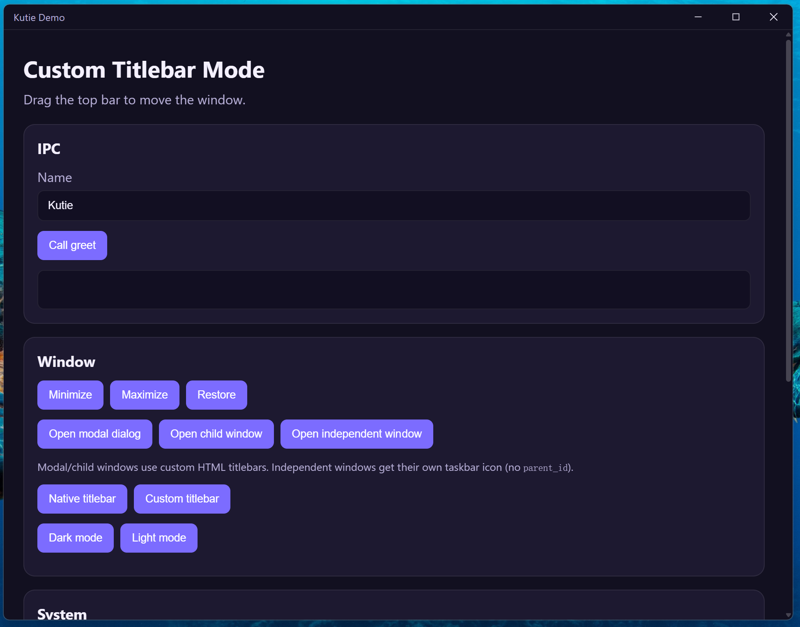

# Kutie

基于 WebView2 的轻量级 C++ 桌面应用框架。使用 Web 前端 + C++ 后端构建现代桌面应用，支持单 EXE 部署与资源内存加载。

**一期范围：** 仅 Windows。macOS / Linux 见 [路线图](docs/roadmap.md)。



## 特性

- **单 EXE 部署** — WebView2Loader 静态链接，前端资源嵌入可执行文件
- **内存资源服务** — `AssetBundle` 从内存提供 HTML/CSS/JS，不写入临时文件
- **双向 IPC** — `kutie.call()` Promise 风格调用，C++ `broadcast()` 推送事件
- **自定义标题栏** — `frame=false` + `data-kutie-drag-region` 拖拽区域
- **BrowserWindow** — 类似 Electron 的多窗口 API，支持 modal
- **窗口 API** — 标题、尺寸、位置、最小化/最大化、frame 切换、置顶、可调整大小等
- **生命周期回调** — 关闭（可否决）、resize、minimize、maximize、focus
- **文件对话框与剪贴板**
- **DevTools** — F12 切换（需 `devtools=true`）
- **SPA 回退** — 非静态路径返回 `/index.html`
- **Per-Monitor V2 高 DPI**
- **深色启动** — 窗口与 WebView2 背景色匹配主题
- **开发/生产双模式** — 生产嵌入资源，开发自动读 `sample/frontend`

## 快速开始

### 环境要求

- Visual Studio 2019+（C++ 桌面开发）
- vcpkg + triplet `x64-windows-static`（静态 CRT + `WebView2LoaderStatic`）
- Python 3.7+
- PowerShell 5.1+

### 安装依赖

```powershell
.\build.ps1 -SetupDeps
```

### 构建与运行

```powershell
.\build.ps1
.\build\sample\sample.exe
```

产物为单个 `sample.exe`（无需附带 `WebView2Loader.dll` 或 VC++ 运行库）。终端用户仍需在 Windows 10/11 上安装 [WebView2 Runtime](https://developer.microsoft.com/microsoft-edge/webview2/)。

## 最小示例

### C++

```cpp
#include "kutie/runtime.hpp"

int WINAPI WinMain(HINSTANCE, HINSTANCE, LPSTR, int) {
    kutie::Runtime::Config cfg;
    cfg.main_window.title = "我的应用";
    cfg.main_window.devtools = true;

    kutie::Runtime app(cfg);
    app.ipc().RegisterHandler("greet", [](const nlohmann::json& args) {
        return nlohmann::json{{"message", "你好, " + args.value("name", "World")}};
    });
    return app.Run();
}
```

### JavaScript

```javascript
const res = await kutie.call('greet', { name: 'Kutie' });
kutie.on('heartbeat', (data) => console.log(data));
```

### 自定义标题栏

```cpp
cfg.main_window.frame = false;  // 自定义标题栏（partial decoration）
```

```html
<div class="titlebar" data-kutie-drag-region>
  <button onclick="kutie.BrowserWindow.getCurrent().close()">×</button>
</div>
```

详见 [docs/custom-titlebar.zh.md](docs/custom-titlebar.zh.md)。

## 架构

```
Runtime → IpcHub + AssetBundle + BrowserWindow (WinBrowserWindow / WebView2)
```

详见 [docs/architecture.zh.md](docs/architecture.zh.md)。

## 文档

| 文档 | 说明 |
|---|---|
| [architecture.zh.md](docs/architecture.zh.md) | 模块设计 |
| [features/browser-window.zh.md](docs/features/browser-window.zh.md) | 多窗口 API |
| [ipc-protocol.zh.md](docs/ipc-protocol.zh.md) | IPC 协议 |
| [asset-bundling.md](docs/asset-bundling.md) | 资源打包 |
| [windows-backend.zh.md](docs/windows-backend.zh.md) | WebView2 后端 |
| [custom-titlebar.zh.md](docs/custom-titlebar.zh.md) | 自定义标题栏 |
| [api-reference.md](docs/api-reference.md) | API 参考 |
| [packaging.zh.md](docs/packaging.zh.md) | 打包与引用 |
| [roadmap.md](docs/roadmap.md) | 路线图 |
| [CHANGELOG.md](CHANGELOG.md) | 更新日志 |

## 许可证

MIT
