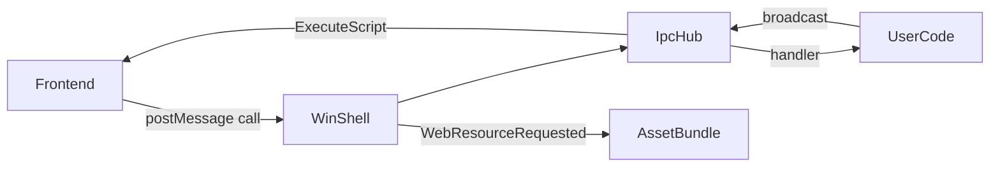

# Architecture

Kutie separates portable runtime code from platform-specific shell implementations.

## Module Overview

| Module | Role |
|---|---|
| `Runtime` | Application entry, config, asset bootstrap, built-in IPC handlers |
| `IpcHub` | Command registry, JSON envelope dispatch, event broadcast |
| `AssetBundle` | In-memory virtual asset store, MIME inference, SPA fallback helper |
| `IShell` | Window + WebView abstraction |
| `WinShell` | Windows implementation (Win32 + WebView2) |
| `PlatformServices` | Dialogs, clipboard, message boxes |

## Data Flow

## Extension Points

- Register custom IPC handlers on `Runtime::ipc()`
- Inject assets at runtime via `AssetBundle::Put()`
- Implement `IShell` for new platforms (macOS WKWebView, Linux WebKitGTK)
- Factory entry: `CreateShell()` in `include/kutie/platform/shell_factory.hpp`

## Threading

- IPC handlers run on the WebView2 callback thread; keep handlers fast
- Handlers are invoked outside the registry mutex to avoid deadlocks when broadcasting events
- Background threads should use `ipc().Broadcast()` only while the shell is alive

## Future Platforms

Phase 2 adds `MacShell` (WKWebView + `titleBarStyle: Overlay`).
Phase 3 adds `GtkShell` (WebKitGTK).

See [roadmap.md](roadmap.md).
