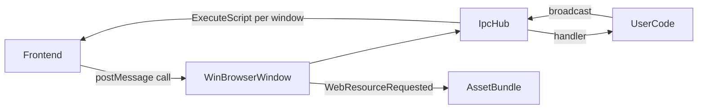

# Architecture

Kutie separates portable runtime code from platform-specific window implementations.

## Module Overview

| Module | Role |
|---|---|
| `Runtime` | Application entry, config, asset bootstrap, message loop, built-in IPC handlers |
| `BrowserWindow` | Window + WebView abstraction (Electron-style) |
| `WinBrowserWindow` | Windows implementation (Win32 + WebView2) |
| `WinWebViewHost` | Shared WebView2 environment |
| `IpcHub` | Command registry, JSON envelope dispatch, per-window script delivery |
| `AssetBundle` | In-memory virtual asset store, MIME inference, SPA fallback helper |
| `PlatformServices` | Dialogs, clipboard, message boxes |

## Data Flow

## Extension Points

- Register custom IPC handlers on `Runtime::ipc()`
- Inject assets at runtime via `AssetBundle::Put()`
- Create additional windows via `BrowserWindow::Create()` or JS `kutie.BrowserWindow.create()`
- Implement `BrowserWindow` for new platforms (macOS WKWebView, Linux WebKitGTK)

## Threading

- IPC handlers run on the WebView2 callback thread; keep handlers fast
- Handlers are invoked outside the registry mutex to avoid deadlocks when broadcasting events
- Background threads should use `ipc().Broadcast()` only while windows are alive

## Future Platforms

Phase 2 adds macOS `BrowserWindow` backend (WKWebView + titlebar overlay).
Phase 3 adds Linux `BrowserWindow` backend (WebKitGTK).

See [roadmap.md](roadmap.md).

See also [architecture.zh.md](architecture.zh.md) (Chinese).
