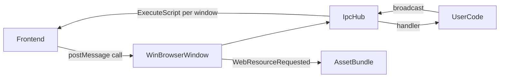

# 架构

Kutie 将可移植的运行时代码与平台相关的窗口实现分离。

## 模块概览

| 模块 | 职责 |
|---|---|
| `Runtime` | 应用入口、配置、资源引导、消息循环、内置 IPC 处理器 |
| `BrowserWindow` | 窗口 + WebView 抽象（类似 Electron） |
| `WinBrowserWindow` | Windows 实现（Win32 + WebView2） |
| `WinWebViewHost` | 共享 WebView2 环境 |
| `IpcHub` | 命令注册、JSON 信封分发、按窗口脚本投递 |
| `AssetBundle` | 内存虚拟资源存储、MIME 推断、SPA 回退 |
| `PlatformServices` | 对话框、剪贴板、消息框 |

## 数据流

## 扩展点

- 在 `Runtime::ipc()` 上注册自定义 IPC 处理器
- 通过 `AssetBundle::Put()` 在运行时注入资源
- 通过 `BrowserWindow::Create()` 或 JS `kutie.BrowserWindow.create()` 创建额外窗口
- 为新平台实现 `BrowserWindow`（macOS WKWebView、Linux WebKitGTK）

## 线程模型

- IPC 处理器在 WebView2 回调线程上运行；请保持处理器轻量
- 处理器在注册表互斥锁外调用，避免广播事件时死锁
- 后台线程仅在窗口存活时使用 `ipc().Broadcast()`

## 后续平台

Phase 2 增加 macOS `BrowserWindow` 后端（WKWebView + 标题栏 overlay）。
Phase 3 增加 Linux `BrowserWindow` 后端（WebKitGTK）。

详见 [roadmap.md](roadmap.md)。

另见英文版 [architecture.md](architecture.md)。
